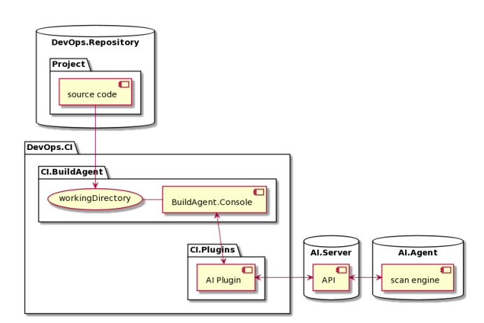

# Инструкция по интеграции PT AI  в CI для разработки JAVA/C++

Плагины осуществляют полный цикл взаимодействия с сервером PT AI Enterprise Edition
(далее также — PT AI Enterprise Server): авторизацию, передачу исходного кода, постановку
задачи сканирования, отслеживание прогресса ее выполнения и загрузку полученных
результатов. На этапе постановки задачи сканирования PT AI Enterprise Server добавляет ее в
очередь, а затем передает на выполнение первому освободившемуся агенту сканирования
(далее также — PT AI Enterprise Agent).

Шаги сборки запускаются в последовательности, указанной в параметрах настройки проекта
CI/CD-системы. Одним из таких шагов является вызов плагина для анализа кода. В общем
случае плагины запускаются как отдельный модуль на агенте сборки CI/CD-системы. Схема
взаимодействия PT AI Enterprise Edition с DevOps-инфраструктурой представлена на рисунке
ниже.

DevOps.Repository -  Корпоративное хранилище с исходным кодом для сканирования;

DevOps.CI -          Корпоративная CI-система, в которой запускаются сборки;

CI.BuildAgent -      Сборочный агент CI-системы. Получает исходный код и предоставляет его для
                     использования плагинам;

BuildAgent.Console - Системная консоль сборочного агента;

CI.Plugins -         Плагины CI-системы AI.Plugin Плагин PT AI Enterprise Edition. Отправляет
                     исходный код в PT AI Enterprise Server, отслеживает прогресс и скачивает отчеты;

AI.Server -          Модуль PT AI Enterprise Server. Принимает исходный код, ставит задачу
                     сканирования модулю PT AI Enterprise Agent и сохраняет результаты;

AI.Agent -           Модуль PT AI Enterprise Agent. Принимает задачу сканирования от
                     PT AI Enterprise Server и возвращает результаты.

## Предварительные требования

Минимальные аппаратные и программные требования для компьютера с модулем
PT AI Enterprise Server:

- x86_64-совместимый 8-ядерный процессор с тактовой частотой 2,4 ГГц;
- 16 ГБ оперативной памяти;
- 200 ГБ на жестком диске;
- сетевой адаптер 10 Мбит/с;
- операционная система: Debian версий 10, 11, CentOS версии 8, Ubuntu версий 18.04 LTS,
  20.04 LTS, 21.04, 21.10, 22.04, 22.10, «РЕД ОС» версии 7.3; Astra Linux версий 1.7 и 2.12;
- дополнительное ПО: Docker CE версии 20 или выше;
- доступные порты 80, 443, 5432, 5671, 5672, 8501 для взаимодействия с PT AI Enterprise
  Agent.
  Примечание. Если между PT AI Enterprise Server и клиентом установлен прокси-сервер,
  необходимо на стороне прокси-сервера разрешить обмен данными по протоколу
  WebSocket.
  Примечание. На компьютере с модулем PT AI Enterprise Server рекомендуется выделить от
  одного до двух объемов оперативной памяти под swap-раздел.
  Минимальные аппаратные и программные требования для компьютера с модулем
  PT AI Enterprise Agent:
- x86_64-совместимый 8-ядерный процессор с тактовой частотой 2,4 ГГц;
- 16 ГБ оперативной памяти;
- 50 ГБ на жестком диске;
- сетевой адаптер 10 Мбит/с;
- операционная система: 64-разрядная версия Windows 10, 64-разрядная версия Windows
  Server 2016, Debian версий 10, 11, CentOS версии 8, Ubuntu версий 18.04 LTS, 20.04 LTS,
  21.04, 21.10, 22.04, 22.10, «РЕД ОС» версии 7.3, Astra Linux версий 1.7 и 2.12;
- дополнительное ПО: Docker CE версии 20 или выше.
  Минимальные аппаратные и программные требования для компьютера с модулем AI.Shell:
- процессор Intel Core i5 с частотой 2 ГГц или аналоги;
- 512 МБ оперативной памяти;
- сетевой адаптер 10 Мбит/с;
- операционная система: 64-разрядная версия Windows 10, 64-разрядная версия Windows
  Server 2016, Debian версий 10, 11, CentOS версии 8, Ubuntu версий 18.04 LTS, 20.04 LTS,
  21.04, 21.10.
  Аппаратные и программные требования 8
  Для работы с веб-интерфейсом рекомендуется использовать браузер:
- Mozilla Firefox 106 и выше, Microsoft Edge, Google Chrome 107 и выше, Safari 15 и выше
  (только для macOS).

## Пошаговые действия

1. Установка продукта PT AI Enterprise.
2. Настройка системных параметров в веб-интерфейсе, в том числе создание токена доступа
3. для подключения PT AI Enterprise Agent к PT AI Enterprise Server.
4. Установка PT AI Enterprise Agent и его подключение к PT AI Enterprise Server по токену
   доступа. Рекомендуется разворачивать PT AI Enterprise Agent на отдельном компьютере,
   чтобы ресурсоемкий анализ кода, выполняемый PT AI Enterprise Agent, не влиял на
   производительность PT AI Enterprise Server. PT AI Enterprise Server поддерживает работу
   нескольких модулей PT AI Enterprise Agent. Увеличение числа установленных модулей
   PT AI Enterprise Agent позволяет одновременно сканировать несколько проектов.
5. Установка AI.Shell, для интеграция с CI-системами.
6. Настройка конфигурационного файла и файла с правилом срабатывания политики
   безопасности для запуска сканирования с помощью AI.Shell.

### Установка продукта PT AI Enterprise

В общем случае установка PT AI Enterprise Edition состоит из следующих этапов:

1. Установка модуля PT AI Enterprise Server.
2. Развертывание модуля PT AI Enterprise Agent:
   • предварительная установка и настройка программ, необходимых для работы модуля;
   • установка модуля;
   • настройка модуля.
3. Установка легкого агента AI.Shell.

#### Установка модуля PT AI Enterprise Server.

Установка PT AI Enterprise Server производится на Linux.

    Внимание! Для работы PT AI Enterprise Server в операционной системе должен быть
              установлен компонент Docker CE версии 20 или выше. Docker CE, установленный из
              snapпакета не йподдерживается.

    Внимание! При установке PT AI Enterprise Server в Astra Linux необходимо использовать
              ядро generic, так как ядро с усиленной защитой (hardened) не позволяет запускать
              непривилегированные контейнеры.

Чтобы установить PT AI Enterprise Server:

1. Запустите скрипт установки:
   sudo sh applicationinspector.<Версия сборки PT AI Enterprise Server>.run
   или
   sudo sh applicationinspector.<Версия сборки PT AI Enterprise Server>.run
   -- --noconfirm, для запуска установки без необходимости подтверждения дальнейших
   операций.
2. При запуске скрипта сформируется файл журнала /var/log/ptai/install/ptaiinstall-<Дата и время>.log
   который содержит информационные сообщения от системы, предупреждения и ошибки. Примечание.
   Сервисы, запущенные в Docker-контейнере, обращаются к узлу, на котором развернут PT AI Enterprise
   Server, по его имени (hostname). Если у вас не настроен DNS-сервер для разрешения имен узлов в
   IP-адреса, вы можете установить соответствие имени узла и IP-адреса, указав параметр
   AdvertiseAddr= в файле /etc/ptai/ptai.conf, а затем перезапустить PT AI Enterprise Server
   командой ptaictl restart, чтобы изменения вступили в силу.
3. Введите y, чтобы принять условия лицензионного соглашения.
4. Введите y, чтобы подтвердить установку PT AI Enterprise Server.
   Начнется установка PT AI Enterprise Server.

   Примечание. По завершении установки вы можете проверить установленные Dockerконтейнеры командой
   docker ps -a. Для мониторинга работы Docker-контейнеров рекомендуется использовать команду docker
   stats или утилиту ctop.

PT AI Enterprise Server установлен. Дистрибутив хранится в каталоге /opt/ptai.

Для управления работой PT AI Enterprise Server из консоли используется скрипт ptaictl. С
помощью скрипта ptaictl вы можете:

- останавливать работу PT AI Enterprise Server командой sudo /opt/ptai/latest/bin/
  ptaictl stop;
- возобновлять работу PT AI Enterprise Server командой sudo /opt/ptai/latest/bin/
  ptaictl start;
- перезапускать PT AI Enterprise Server командой sudo /opt/ptai/latest/bin/ptaictl
  restart;
- удалять PT AI Enterprise Server командой sudo /opt/ptai/latest/bin/ptaictl
  uninstall;
- вызывать список всех доступных команд для PT AI Enterprise Server командой sudo /opt/
  ptai/latest/bin/ptaictl help;
- выполнять замену серверного сертификата и ключа командой sudo /opt/ptai/latest/
  bin/ptaictl cert.
  Команды stop, start, restart и reconf можно выполнять без подтверждения, используя флаг
  --noconfirm.
  Для журналирования в файл результатов выполнения команд stop, start и uninstall
  используется флаг -l или --log. Например, sudo /opt/ptai/latest/bin/ptaictl start
  -l /tmp/log.txt.
  Для команды cert используются флаги:
- -с или --cert Путь к файлу с сертификатом в формате PEM.
- -k или --key Путь к файлу с закрытым ключом в формате PEM, ключ не должен быть зашифрован.
- --norestart Не выполнять перезапуск Docker-контейнеров.

По умолчанию скрипт ptaictl запускается в тихом режиме, без вывода на экран информации
от сервисных команд (кроме данных об ошибках). Для отображения подробной информации вы
можете указать флаг VERBOSE с любым непустым значением. Например, sudo VERBOSE=1 /
opt/ptai/latest/bin/ptaictl stop.

При изменении объема оперативной памяти, выделенной для виртуальной машины,
необходимо выполнить команду ptaictl reconf и перезапустить PT AI Enterprise Server для
пересчета коэффициентов потребления оперативной памяти внутри Docker-контейнеров.
Перезапуск PT AI Enterprise Server осуществляется путем последовательного выполнения
команд ptaictl stop, ptaictl start.

##### Установка сертификатов для подключения к внешнимресурсам по SSL

Если для подключения к внешним ресурсам, таким как SSO, Jira и VCS, у вас используется SSLпротокол,
то для корректного взаимодействия этих ресурсов с PT AI Enterprise Edition необходимо загрузить
в PT AI Enterprise Server один или несколько их корневых сертификатов.

Чтобы загрузить корневые сертификаты в PT AI Enterprise Server:

1. На компьютере с установленным PT AI Enterprise Server скопируйте PEM-файлы SSLсертификатов
   центра сертификации (СА) в следующие каталоги:
   /opt/ptai/_data/volumes/certs/sso/ — для SSO;
   /opt/ptai/_data/volumes/certs/jira/ — для Jira;
   /opt/ptai/_data/volumes/certs/git/ — для VCS (Git, TFS).
2. Перезапустите PT AI Enterprise Server:
   sudo /opt/ptai/latest/bin/ptaictl restart --noimgext

После перезапуска SSL-сертификаты из PEM-файлов будут добавлены в доверенные в следующих
Docker-контейнерах

- auth — использует SSL-сертификаты для подключения к SSO;
- backend — использует SSL-сертификат для подключения к Jira;
- file-content — использует SSL-сертификаты для подключения к VCS (Git, TFS).

#### Развертывание модуля PT AI Enterprise Agent

Этот раздел содержит инструкции по подготовке к развертыванию, установке и настройке
модуля PT AI Enterprise Agent. PT AI Enterprise Agent можно установить на Windows и Linux.
(Дальше будет расмотренн вариант с Linux)

##### Установка модуля PT AI Enterprise Agent для Linux

   Внимание! Для работы PT AI Enterprise Agent в операционной системе должен быть
             установлен компонент Docker CE версии 20 или выше.

   Внимание! При установке PT AI Enterprise Agent в Astra Linux необходимо использовать ядро
             generic, так как ядро с усиленной защитой (hardened) не позволяет запускать
             непривилегированные контейнеры.

Чтобы установить PT AI Enterprise Agent:

1. Сделайте файл инсталлятора исполняемым:
   chmod +x <Версия сборки PT AI Enterprise Agent>.run
2. Запустите скрипт установки:
   sudo ./<Версия сборки PT AI Enterprise Agent>.run
   При запуске скрипта сформируется файл журнала /var/log/ptaiagent/install/
   ptai-agent-install-<Дата и время>.log, который содержит системные
   информационные сообщения, предупреждения и ошибки.
3. Введите y, чтобы принять условия лицензионного соглашения.
4. Введите y, чтобы подтвердить установку PT AI Enterprise Agent. Начнется установка
   PT AI Enterprise Agent.
5. Выберите способ настройки подключения модуля PT AI Enterprise Agent к
   PT AI Enterprise Server:
   * если вы хотите настроить подключение к PT AI Enterprise Server в процессе установки,
     введите y;
   * если вы хотите настроить подключение к PT AI Enterprise Server позднее в
     конфигурационном файле в каталоге /etc/ptai-agent.conf, введите n.
6. Если вы ввели y, укажите следующие параметры:
   * URL PT AI Enterprise Server.
   * Токен доступа (см. раздел «Настройка токенов доступа» в Руководстве пользователя).
   * Уникальное имя PT AI Enterprise Agent.

     Примечание. Указанное имя будет отображаться в веб-интерфейсе на странице
     Агенты сканирования. Имя Docker-контейнера останется прежним — ptai-agent.
   * Имя узла и IP-адрес PT AI Enterprise Server в виде <Имя узла:IP-адрес> (необязательно).

     Примечание. PT AI Enterprise Agent, запущенный в Docker-контейнере, обращается к
     узлу, на котором развернут PT AI Enterprise Server, по его имени (hostname).
     Если у вас не настроен DNS-сервер для разрешения имен узлов в IP-адреса, вы
     можете установить соответствие имени узла и IP-адреса c помощью этого параметра.

PT AI Enterprise Agent установлен. Дистрибутив хранится в каталоге /opt/ptai-agent.

##### Настройка модуля PT AI Enterprise Agent

Чтобы настроить модуль PT AI Enterprise Agent для Linux:

1. Откройте файл ptai-agent.conf в каталоге /etc.
2. Измените нужные строки в файле:
   SERVER_URL="<Адрес PT AI Enterprise Server>"
   HOSTS="<Имя узла PT AI Enterprise Server:IP-адрес PT AI Enterprise Server>"
   AGENT_TOKEN="<Токен доступа>"
   AGENT_NAME="<Уникальное имя PT AI Enterprise Agent>"
3. Перезапустите Docker-котейнер PT AI Enterprise Agent:
   sudo systemctl restart ptai-agent.
   
Модуль PT AI Enterprise Agent настроен.

#### **Установка легкого агента AI.Shell**
