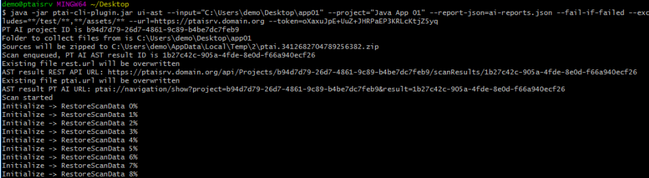

Установка и настройка PT AI Plugin
==================================

Установка PT AI Plugin
----------------------

Чтобы установить плагин AI.Cli.Plugin:
1.  Установите последнюю версию Java JDK 8.
2.  Загрузите плагины с помощью Git: `git clone https://github.com/POSIdev-community/ptai-ee-tools`
3.  В командной строке перейдите в корень каталога с плагином и выполните:
    `gradlew build`, для сборки AI.Cli.Plugin.
    
    Плагины доступны по следующим пути:
    — `ptai-cli-plugin\build\libs\ptai-cli-plugin.jar`.

    Примечание. Если в процессе сборки вы получили ошибку, добавьте каталог с исходным
                кодом плагина в список исключений для вашего антивируса и повторите сборку. Если
                проблема не решится, обратитесь в Positive Technologies.

Настройка безопасное соединение
-------------------------------

1.  Импортируйте цепочку SSL-сертификатов удостоверяющего центра, выпустившего
    SSL-сертификат для PT AI Enterprise Server, или сам сертификат PT AI Enterprise Server
    (при использовании самоподписанного сертификата) в хранилище сертификатов Java.
    Вам потребуются сертификаты в кодировке Base64 (PEM-формат) и утилита `keytool`
    (входит в пакет Java JDK).

    Примечание. Если иерархия сертификатов, используемых для выпуска сертификата
                PT AI Enterprise Server, содержит Root CA и Intermediate CA как показано на рисунке
                ниже, необходимо экспортировать оба этих сертификата в кодировке Base64.
                
    Импортируйте сертификаты с использованием keytool (пример команды для ОС
    семейства Unix):
    ```
    keytool -importcert -keystore jdk1.8\jre\lib\security\cacerts -storepass "changeit" -alias
    AIRootCA -file RootCA.pem –noprompt
    keytool -importcert -keystore jdk1.8\jre\lib\security\cacerts -storepass "changeit" -alias
    AIIntermediateCA -file IntermediateCA.pem –noprompt
    ```
2.  Используйте параметр плагина `–truststore` для указания пути к PEM-файлу с цепочкой
    сертификатов сервера. Аналогично примеру выше вам потребуется экспортировать
    сертификаты в кодировке Base64, затем в текстовом редакторе соединить их в цепочку
    в обратном порядке: Intermediate → Root и сохранить в файл. Параметр нужно
    использовать для каждой команды запуска плагина.
3.  Используйте параметр плагина `--insecure` для работы без указания сертификата (не
    рекомендуется при развертывании в рабочей среде). При использовании этого
    параметра сохраняется возможность установки защищенного соединения с
    PT AI Enterprise Server, но не выполняется проверка принадлежности сертификата,
    предъявленного сервером в ходе установки SSL-соединения, этому серверу. Параметр
    нужно использовать для каждой команды запуска плагина.
4.  Использовать токен доступа. 
    [Инструкция по созданию токена](PTAI_Server/README.md#создание-токенов-доступа).

Проверьте соединение с PT AI Enterprise Server, выполнив команду:
```
java -jar ptai-cli-plugin.jar check-server --url=https://<Адрес PT AI Enterprise Server>
--token=<Ваш токен>
```

Подготовка команды запуска сканирования
---------------------------------------

Чтобы подготовить команду запуска сканирования:

1.  Укажите полный путь к плагину в вызове Java:
    ```
    java -jar ptai-cli-plugin.jar
    ```
2.  Определите способ настройки сканирования одним из параметров:
    * `ui-ast`, если проект сканирования создан в веб-интерфейсе PT AI Server;
    * `json-ast`, если при запуске плагина вы хотите указать конфигурационный файл и файл политики безопасности.
3.  Если вы ввели `ui-ast`, в параметре `--project` укажите имя проекта, созданного в PT AI
    Server.
4.  Если вы ввели `json-ast`, в параметрах `--settings-json` и `--policy-json` укажите путь
    к конфигурационному файлу и файлу политики безопасности (необязательно) в формате JSON.
5.  Укажите путь к каталогу с исходным кодом в параметре `--input`.
6.  Определите режим сканирования:
    * `--async` для сканирования в асинхронном режиме. В этом случае будет запущена
      проверка кода на наличие уязвимостей и сборка продолжится, не дожидаясь
      завершения проверки.
    * по умолчанию для сканирования в синхронном режиме. В этом случае будет запущена
      проверка кода на наличие уязвимостей и сборка не продолжится до тех пор, пока
      проверка не завершится.
7.  Укажите требования к отчету об уязвимостях:
    * Для формирования одного отчета укажите параметры из таблицы ниже.
    * Для формирования нескольких отчетов укажите требования в JSON-файле и задайте
      путь к нему в параметре `--report-json`. Синтаксис файла приведен в приложении.
8.  Укажите параметры подключения к PT AI Server:
    `--url` — адрес PT AI Enterprise Server.
    `--token` — токен доступа для плагинов CI/CD. 
    [Инструкция по созданию токена](PTAI_Server/README.md#создание-токенов-доступа).
9.  Укажите условия неуспешного сканирования (только для синхронного режима):
    * Добавьте параметр `--fail-if-failed`, чтобы плагин завершал работу с ошибкой при
      несоответствии сканируемого приложения заданной политике безопасности.
    * Добавьте параметр `--fail-if-unstable`, чтобы плагин завершал работу с ошибкой при
      возникновении ошибок, не связанных с результатами проверки кода на наличие
      уязвимостей (например, ошибки в конфигурации, отсутствующая или недействительная
      лицензия).
10. Укажите каталог для сохранения отчетов по результатам сканирования в параметре `--output`
    (по умолчанию используется каталог `.ptai`).
    
    Примечание. Во всех режимах работы плагин создает файл `rest.url` со ссылкой на
                результаты сканирования в формате JSON. Для открытия этой ссылки необходимо
                использовать токен доступа, который можно получить через API.
            
11. С помощью параметров `--includes` и `--excludes` добавьте или исключите
    определенные файлы из сканирования по маске. Используется синтаксис Apache Ant.
12. Добавьте параметр `--verbose` для включения расширенного протоколирования
    действий плагина.
13. Выполните получившуюся команду.
    Если все параметры указаны корректно, отобразится уведомление о постановке
    сканирования в очередь, как показано на рисунке ниже.

    

римеры команд запуска плагина:

— Проект создан в веб-интерфейсе PT AI Server, синхронный блокирующий запуск
с генерацией отчетов:
```
java -jar ptai-cli-plugin.jar ui-ast --input="/home/folder" --
project="ProjectName"
--report-json=ai-reports.json --fail-if-failed --excludes=**/test/**,**/assets/
**
--url=https://ptaisrv.domain.org --token=yourtoken
```

— Проект создается на основе файла конфигурации, асинхронный запуск:
```
java -jar ptai-cli-plugin.jar json-ast --input="/home/folder" --settingsjson=ai-settings.json
--policy-json=ai-policy.json --async --excludes=**/test/**,**/assets/**
--url=https://ptaisrv.domain.org --token=yourtoken
```

| Формат отчета                   | Параметр                 | Возможные значения                                                                 |
|----------------------------------|--------------------------|-------------------------------------------------------------------------------------|
| HTML                             | --report-template         | Список возможных значений представлен в веб-интерфейсе PT AI Server в разделе Шаблоны отчетов |
|                                  | --report-file             | Имя файла                                                                          |
|                                  | --report-include-dfd      | True или false                                                                    |
|                                  | --report-includeglossary  | True или false                                                                    |
| SARIF                            | --sarif-report-file       | Имя файла                                                                          |
| SonarGiif                        | --giif-report-file        | Имя файла                                                                          |
| Необработанные данные в формате JSON | --raw-data-file        | Имя файла                                                                          |

Создание отчетов по результатам сканирования
--------------------------------------------

Чтобы создать отчет по результатам сканирования в асинхронном режиме:
1.  Укажите полный путь к плагину в вызове Java и параметр для создания отчетов
generate-report:
    ```
    java -jar ptai-cli-plugin.jar generate-report
    ```
2.  Укажите идентификатор проекта (`--project-id`) или его имя (`--project-name`).
    Примечание. Плагин генерирует файл `rest.url`, который содержит идентификатор
                проекта для автоматической подстановки этого параметра в скриптах.
3.  Укажите идентификатор результата сканирования (`--scan-result-id`).
   
    Примечание. Вы можете скопировать его из вывода плагина при постановке задачи
                сканирования в очередь, либо из файла `rest.url`. Если параметр не указан, будет
                выгружен результат последнего сканирования указанного проекта.
    
4.  Укажите параметры для создания отчета, описанные на раздела [«Подготовка команды запуска плагина»](#подготовка-команды-запуска-сканирования).

5.  Укажите параметры для подключения к PT AI Server:
    • `--url` — адрес PT AI Server;
    • `--token` — токен доступа для плагинов CI/CD.

Пример команды на создание отчетов:
```
java -jar ptai-cli-plugin.jar generate-report --project-id=projectUUID scanresult-id=resultUUID --report-json=ai-report.json --url=https://
ptaisrv.domain.org --token=yourtoken
```

Подготовка файла с параметрами скаинирования
--------------------------------------------

Основные параметры сканирования:

- `$schema` -- cылка на JSON-схему, описывающаяконфигурационный файл.

- `Version` -- Версия конфигурационного файла.

- `ProjectName` -- Название проекта
  
- `ProgrammingLanguages` -- Стэк анализируемых языков. Возможные значения: Java,
  CSharp (Windows, Linux), CSharp (Windows), VB, Php, JavaScript, Python, ObjectiveC, Swift,
  CAndCPlusPlus, Go, Kotlin, Sql, Ruby

- `ScanModules` --Модули поиска уязвимостей: Configuration, Components, BlackBox, PatternMatching,
  StaticCodeAnalysis

- `SkipGitIgnoreFiles` -- Флаг для исключения файлов и папок, указанные в .gitignore.
  
- `MailingProjectSettings` -- Параметры для настройки отправки почтовых отчетов.
  
- `UseSecurityPolicies` -- Флаг для использование политик безопасности
  
- `UseSastRules` -- Флаг для использование правил анализа SAST 

- `UseCustomPmRules` -- Флаг для использование правил анализа по пользовательским шаблонам 

- `JavaSettings` -- Параметры настройки анализа Java кода:
  
  * `Parameters` -- Параметры запуска Java Virtual Machine
  * `UnpackUserPackages` -- Флан для распаковки пользовательских JAR-файлов
  * `UserPackagePrefixes` -- Префиксы пользовательских пакетов
  * `Version` -- Версия JDK: 8, 11, 17
  * `CustomParameters` -- Дополнительные параметры запуска модуля анализа
  * `DownloadDependencies` -- Флаг для загружать зависимости
  * `UsePublicAnalysisMethod` -- Флаг для поиска от доступных методов public и protected

- `CAndCPlusPlus` -- Параметры настройки анализа Java кода:
  
  * `Parameters` -- Параметры запуска
  * `CustomParameters` -- Дополнительные параметры запуска модуля анализа
  * `DownloadDependencies` -- Флаг для загружать зависимости
  * `UsePublicAnalysisMethod` -- Флаг для поиска от доступных методов public и protected
