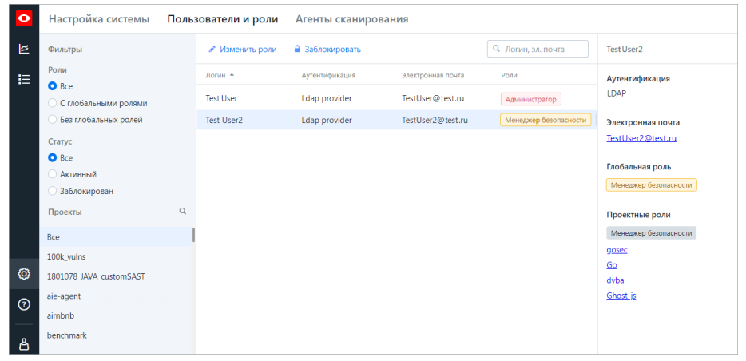

Установка и настройка PT AI Server
==================================

Установка модуля PT AI Enterprise Server
----------------------------------------

Установка PT AI Enterprise Server производится на Linux.

    Внимание! Для работы PT AI Enterprise Server в операционной системе должен быть
              установлен компонент Docker CE версии 20 или выше. Docker CE, установленный из
              snapпакета не йподдерживается.

    Внимание! При установке PT AI Enterprise Server в Astra Linux необходимо использовать
              ядро generic, так как ядро с усиленной защитой (hardened) не позволяет запускать
              непривилегированные контейнеры.

Чтобы установить PT AI Enterprise Server:

1.  Запустите скрипт установки:
    `sudo sh applicationinspector.<Версия сборки PT AI Enterprise Server>.run`

2.  При запуске скрипта сформируется файл журнала
    `/var/log/ptai/install/ptaiinstall-<Дата и время>.log` который содержит информационные сообщения
    от системы, предупреждения и ошибки. Примечание. Сервисы, запущенные в Docker-контейнере,
    обращаются к узлу, на котором развернут PT AI Enterprise Server, по его имени (hostname). Если у
    вас не настроен DNS-сервер для разрешения имен узлов в IP-адреса, вы можете установить
    соответствие имени узла и IP-адреса, указав параметр `AdvertiseAddr=` в файле `/etc/ptai/ptai.conf`,
    а затем перезапустить PT AI Enterprise Server командой `ptaictl restart`, чтобы изменения вступили
    в силу.
3.  Введите y, чтобы принять условия лицензионного соглашения.
4.  Введите y, чтобы подтвердить установку PT AI Enterprise Server. Начнется установка
    PT AI Enterprise Server.

    Примечание. По завершении установки вы можете проверить установленные Docker контейнеры командой
                `docker ps -a`. Для мониторинга работы Docker-контейнеров рекомендуется использовать
                команду `docker stats` или утилиту `ctop`.

PT AI Enterprise Server установлен. Дистрибутив хранится в каталоге `/opt/ptai`.

Для управления работой PT AI Enterprise Server из консоли используется скрипт `ptaictl`. С
помощью скрипта `ptaictl` вы можете:

- останавливать работу PT AI Enterprise Server командой `sudo /opt/ptai/latest/bin/
  ptaictl stop`;
- возобновлять работу PT AI Enterprise Server командой `sudo /opt/ptai/latest/bin/
  ptaictl start`;
- перезапускать PT AI Enterprise Server командой `sudo /opt/ptai/latest/bin/ptaictl
  restart`;
- удалять PT AI Enterprise Server командой `sudo /opt/ptai/latest/bin/ptaictl
  uninstall`;
- вызывать список всех доступных команд для PT AI Enterprise Server командой `sudo /opt/
  ptai/latest/bin/ptaictl help`;
- выполнять замену серверного сертификата и ключа командой `sudo /opt/ptai/latest/
  bin/ptaictl cert`.
  Команды `stop`, `start`, `restart` и `reconf` можно выполнять без подтверждения, используя флаг
  `--noconfirm`.
  Для журналирования в файл результатов выполнения команд `stop`, `start` и `uninstall`
  используется флаг `-l` или `--log`. Например, `sudo /opt/ptai/latest/bin/ptaictl start
  -l /tmp/log.txt`.
  Для команды cert используются флаги:
- `-с` или `--cert` Путь к файлу с сертификатом в формате PEM.
- `-k` или `--key` Путь к файлу с закрытым ключом в формате PEM, ключ не должен быть зашифрован.
- `--norestart` Не выполнять перезапуск Docker-контейнеров.

По умолчанию скрипт `ptaictl` запускается в тихом режиме, без вывода на экран информации
от сервисных команд (кроме данных об ошибках). Для отображения подробной информации вы
можете указать флаг `VERBOSE` с любым непустым значением. Например, `sudo VERBOSE=1 /
opt/ptai/latest/bin/ptaictl stop`.

При изменении объема оперативной памяти, выделенной для виртуальной машины,
необходимо выполнить команду `ptaictl` `reconf` и перезапустить PT AI Enterprise Server для
пересчета коэффициентов потребления оперативной памяти внутри Docker-контейнеров.
Перезапуск PT AI Enterprise Server осуществляется путем последовательного выполнения
команд `ptaictl stop`, `ptaictl start`.

Установка сертификатов для подключения к внешним ресурсам по SSL
----------------------------------------------------------------

Если для подключения к внешним ресурсам, таким как SSO, Jira и VCS, у вас используется SSLпротокол,
то для корректного взаимодействия этих ресурсов с PT AI Enterprise Edition необходимо загрузить
в PT AI Enterprise Server один или несколько их корневых сертификатов.

Чтобы загрузить корневые сертификаты в PT AI Enterprise Server:

1. На компьютере с установленным PT AI Enterprise Server скопируйте PEM-файлы SSLсертификатов
   центра сертификации (СА) в следующие каталоги:
   `/opt/ptai/_data/volumes/certs/sso/` — для SSO;
   `/opt/ptai/_data/volumes/certs/jira/` — для Jira;
   `/opt/ptai/_data/volumes/certs/git/` — для VCS (Git, TFS).
2. Перезапустите PT AI Enterprise Server:
   `sudo /opt/ptai/latest/bin/ptaictl restart --noimgext`

После перезапуска SSL-сертификаты из PEM-файлов будут добавлены в доверенные в следующих
Docker-контейнерах

- `auth` — использует SSL-сертификаты для подключения к SSO;
- `backend` — использует SSL-сертификат для подключения к Jira;
- `file-content` — использует SSL-сертификаты для подключения к VCS (Git, TFS).

Вход в web интерфейс
--------------------

Чтобы перейти в веб-интерфейс PT AI Enterprise Edition:

1.  В адресной строке браузера введите FQDN или IP-адрес компьютера с установленным
    PT AI Enterprise Server. Откроется страница входа в веб-интерфейс PT AI Enterprise Edition.
2.  Выполните локальный вход или вход через настроенную у вас SSO-систему по
    соответствующей кнопке.
    
    Примечание. При первом входе администратора в систему отображаются только поля
                для локального входа. Логин по умолчанию — root, пароль — root. После входа
                автоматически откроется страница смены пароля.

Вход в веб-интерфейс PT AI Enterprise Edition выполнен. Более подробное описание веб интерфейса 
 можете прочитать в [официальной документации](https://pt-corp.storage.yandexcloud.net/user_s_manual_2fa35da82a_529e3d51d9.pdf)

Настройка пользователей
-----------------------

### Роли пользователей

После аутентификации через SSO-систему пользователь авторизуется в PT AI Enterprise
Edition с определенным набором полномочий. Каждому набору полномочий соответствует
роль: глобальная или проектная. Глобальные роли наделяют пользователей полномочиями по
администрированию системы, управлению другими ролями и проектами. Проектные роли
позволяют выполнять действия только в проекте, на который назначен пользователь

- **Администратор** - (Глобальная) Обладает абсолютными полномочиями в PT AI Enterprise Edition, имеет
  доступ ко всем функциям системы, выполняет её настройку, управляет правами доступа других
  пользователей. Примечание: Для первоначальной настройки системы и глобальных ролей предусмотрен
  системный пользователь `root`, который обладает полномочиями администратора. Этого пользователя
  нельзя удалить или изменить его полномочия.

- **Глобальный менеджер безопасности** - (Глобальная) Создаёт новые проекты. При создании проекта
  глобальный менеджер безопасности автоматически получает в этом проекте роль проектного
  менеджера безопасности и все его полномочия.

- **Проектный менеджер безопасности** - (Проектная) Обладает полномочиями только в тех проектах, на
  которые он назначен. Полномочия: назначает в свой проект других пользователей с проектной ролью,
  настраивает параметры сканирования проекта, запускает сканирование проекта, работает с результатами
  сканирования, выпускает отчёты по результатам сканирования, создаёт задачи в Jira, удаляет проект.
  Роль проектного менеджера безопасности также включает в себя полномочия роли аудитора.

- **Разработчик** - (Проектная) Обладает полномочиями только в тех проектах, на которые он назначен.
  Полномочия: просматривает параметры сканирования проекта, просматривает результаты сканирования
  без возможности изменять статусы найденных уязвимостей, создаёт задачи в Jira.

- **Аудитор** - (Проектная) Обладает полномочиями только в тех проектах, на которые он назначен.
  Полномочия: просматривает параметры сканирования проекта, работает с результатами сканирования,
  выпускает отчёты по результатам сканирования, создаёт задачи в Jira.

Процесс назначения ролей пользователям выглядит следующим образом:

1.  Root-пользователь при настройке аутентификации через SSO добавляет администратора.
2.  Администратор настраивает соответствие пользователей из SSO-системы глобальным
    ролям в PT AI Enterprise Edition и назначает глобальные роли.
3.  Администратор и глобальный менеджер создают новые проекты и назначают в них
    пользователей с проектными ролями (проектных менеджеров безопасности и аудиторов).
4.  Проектный менеджер безопасности при необходимости добавляет в свой проект других
    проектных менеджеров и аудиторов.

Создание токенов доступа
------------------------

Чтобы создать токен доступа:
1.  По кнопке настройки в главном меню откройте страницу Администрирование.
2.  В разделе Токены доступа нажмите кнопку Создать токен. Откроется окно Новый токен доступа.
3.  Введите уникальное название токена доступа.
4.  Установите флажок:
    • Для легкого агента и плагинов CI/CD, чтобы разрешить подключение легкого агента
      AI.Shell и CI-агентов сборки к PT AI Enterprise Server по этому токену.
    • Для агента сканирования, чтобы разрешить подключение PT AI Enterprise Agent к
      PT AI Enterprise Server по этому токену.
5.  Укажите дату истечения срока действия токена или установите флажок Бессрочный.
6.  Нажмите кнопку Создать.
    Новый токен доступа сгенерирован.
7.  В открывшемся окне скопируйте токен доступа и используйте его при настройке
    подключения соответствующего приложения к PT AI Enterprise Server.

Создание проекта в PT AI Server
-------------------------------

## Подготовка данных для сканирования

Перед созданием проекта сканирования убедитесь, что компьютер с модулем PT AI Enterprise
Agent и данные для сканирования отвечают следующим требованиям:

— На жестком диске обеспечен объем памяти, необходимый для сканирования проекта.
  Объем памяти зависит от размера проекта, на 1000 файлов требуется около 5 ГБ
  свободного дискового пространства.
— В качестве объекта сканирования указана корневая папка с рабочей версией приложения.
  Приложение компилируется без ошибок и содержит все файлы проекта, библиотеки и
  зависимости, используемые в проекте.
— Для Java-приложений объектом сканирования может быть как папка с исходным кодом
  приложения (JAVA), так и папка, содержащая скомпилированный проект (CLASS). Если
  папка содержит файлы обоих типов (JAVA и CLASS), файлы JAVA для совпадающих имен
  классов необходимо удалить.
— Подготовлен тестовый стенд для проверки запросов и сканирования методом черного
  ящика. Использование тестового стенда уменьшает риск повреждения и удаления данных.
— Если в проекте сканирования используются библиотеки (dll-файлы), не распространяемые
  в виде nuget-пакетов, убедитесь, что необходимые файлы есть на диске, либо установлены
  в глобальном кэше сборок (GAC).
— Антивирусные программы, межсетевые экраны и Microsoft Windows Defender отключены.

## Создание проекта сканирования

Полномочиями для создания новых проектов сканирования в PT AI Enterprise Edition обладают
только администратор и глобальный менеджер безопасности.

Чтобы создать новый проект в веб-интерфейсе и настроить сканирование:

1.  В главном меню откройте страницу **Проекты**.
2.  Нажмите кнопку **Создать** в левой верхней части страницы.
3.  В открывшемся окне выберите объект сканирования нажмите кнопку **Выбрать позже**. Будет создан
    проект без исходного кода. Первое сканирование необходимо запустить на агенте сборки. После
    сканирования исходный код приложения будет загружен в PT AI Server и повторные сканирования
    можно будет запускать в веб-интерфейсе.
4.  Нажмите кнопку **Продолжить**.
5.  Для папки в раскрывающемся блоке **Исключения при загрузке** укажите файлы,
    форматы файлов или папки, которые будут исключены при загрузке проекта.
6.  Нажмите **Продолжить**.
    Начнется загрузка объекта сканирования в PT AI Server. По завершении
    загрузки откроется окно **Настройка сканирования**.
7.  Установите флажок **Скрывать путь и имя пользователя**.
8.  Если требуется, измените название проекта.
9.  В раскрывающемся списке **Языки приложения** выберите С++ и Java.
    Примечание. Параметр устанавливается автоматически, если при выборе источника
                исходного кода удалось определить языки приложения.
10.  Установите флажки **Белый ящик**.
11. Cнимите флажок **Запустить сканирование**.
12. Для Java указать необходимые параметры:
    - Распаковка пользовательских JAR-файлов -- Параметр включает распаковку JAR-файлов с их
      последующим анализом. PT AI Enterprise Edition анализирует JAR-файлы только при включенном
      параметре.
    - Префиксы пользовательских пакетов -- Параметр для отладки. Указываются через символ «|»
      без пробелов, например: com.example|ru.example.
    - Параметры запуска Java Virtual Machine -- Параметры для запуска JVM. Перечень возможных
      параметров приведен в официальной документации Java.
    - Версия JDK -- Параметр для выбора версии JDK, необходимой для компиляции Java-проектов.
    - Параметры запуска -- Параметры для отладки модулей анализа, например, изменение уровня
      журналирования.
    - Использование доступных методов public и protected -- Каждый доступный метод
      рассматривается как точка входа, а его аргументы — как параметры. Режим повышает покрытие,
      но может затруднить построение векторов атак.
    - Загрузка зависимостей -- При включении параметра перед сканированием происходит выгрузка
      зависимостей из репозиториев при помощи Maven.
13. Для C++ указать необходимые параметры:
    - Параметры запуска — Параметры для отладки модулей анализа, например, изменение уровня
      журналирования модулей анализа.
    - Использование доступных методов public и protected — Каждый доступный метод рассматривается
      как точка входа, а его аргументы — как параметры точки входа. В этом режиме не всегда возможно
      построение векторов атак, но обеспечивается максимально возможное покрытие кода.
    - Загрузка зависимостей — При включении параметра перед сканированием происходит выгрузка
      зависимостей из репозиториев при помощи например conan.io (для C++).
14.  Нажмите кнопку **Создать проект**.

Настройка политики безопасности
-------------------------------

Чтобы настроить политику безопасности:

1.  В главном меню откройте страницу **Проекты**.
2.  Выберите проект в списке.
3.  В панели над списком проектов нажмите кнопку **Настройка**.
    Откроется страница **Настройка <Название проекта>**.
4.  Выберите раздел **Политика безопасности**.
5.  Установите флажок **Проверять соответствие политике безопасности**, чтобы
    включить проверку результатов сканирования на соответствие заданной в проекте
    политике безопасности.
6.  Введите текст правила срабатывания политики безопасности или добавьте стандартный
    шаблон с правилом по кнопке **Добавить шаблон**.

    Создайте шаблон использую ниже перечисленные параметры:

    | Название раздела | Название строки   | Описание строки |
    |:-----------------|:------------------|:----------------|
    | Policy           | ID                 | Произвольное строковое обозначение (необязательное, уникальное) |
    | Policy           | CountToActualize   | Минимально необходимое количество срабатываний политики на найденных уязвимостях (если 0 или не задано, то достаточно одного срабатывания) |
    | Policy           | Scopes             | Наборы правил (политика сработает, если хотя бы один набор актуален) |
    | Scope            | Rules              | Список правил внутри одного набора (если для каждого правила в наборе найдены соответствующие уязвимости, набор актуален) |
    | Rules            | Field              | Название поля уязвимости |
    | Rules            | Value              | Значение поля, требуемое для срабатывания правила (регистронезависимо, если не задан параметр IsRegex) |
    | Rules            | IsRegex            | Флаг сравнения по регулярному выражению |

7.  Нажмите кнопку **Сохранить**.
    Если политика безопасности соблюдена, то после сканирования проекта на странице
    **Проекты** в столбце **Политика безопасности** будет отображаться статус
    **Соответствует**, если политика нарушена — статус **Не соответствует**.

Настройка исключений
--------------------

Для уменьшения времени сканирования вы можете исключать из сканирования файлы,
форматы файлов и папки.

Чтобы настроить исключения:

1.  В главном меню откройте страницу **Проекты**.
2.  Выберите проект в списке.
3.  В панели над списком проектов нажмите кнопку **Настройка**.
    Откроется страница **Настройка <Название проекта>**.
4.  Выберите раздел **Исключения**.
5.  Укажите папки, файлы и форматы файлов, которые вы хотите исключить из
    сканирования, как показано в примере.
    
    Примечание. Для настройки исключений используется тот же синтаксис, что и для
                настройки файлов .gitignore. Вы можете просмотреть его по ссылке Документация
                по синтаксису в правой верхней части страницы.
    Примечание. Рекомендуется исключать файлы изображений и файлы c
                расширением .html и .css из списка сканируемых.
6. Нажмите кнопку **Сохранить**.

Также вы можете настроить исключения в отдельном файле .aiignore. Для этого нужно
создать файл, прописать в нем папки, файлы и форматы файлов, используя синтаксис
файлов .gitignore, и положить файл в корневую папку с проектом.

