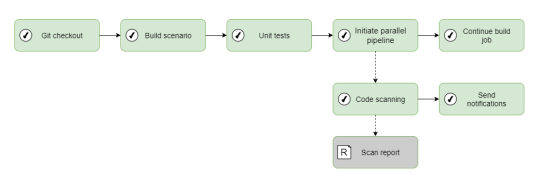

Инструкция по интеграции PT AI  в CI для разработки JAVA/C++
============================================================

Данная инструкция показывает базовую настройку статического анализатора PT AI в рамках
CI/CD-процесса для проектов на Java и C++.

Архитектура
-----------

Плагины осуществляют полный цикл взаимодействия с сервером PT AI Enterprise Edition
(далее также — PT AI Enterprise Server): авторизацию, передачу исходного кода, постановку
задачи сканирования, отслеживание прогресса ее выполнения и загрузку полученных
результатов. На этапе постановки задачи сканирования PT AI Enterprise Server добавляет ее в
очередь, а затем передает на выполнение первому освободившемуся агенту сканирования
(далее также — PT AI Enterprise Agent).

Шаги сборки запускаются в последовательности, указанной в параметрах настройки проекта
CI/CD-системы. Одним из таких шагов является вызов плагина для анализа кода. В общем
случае плагины запускаются как отдельный модуль на агенте сборки CI/CD-системы. Схема
взаимодействия PT AI Enterprise Edition с DevOps-инфраструктурой представлена на рисунке
ниже.

DevOps.Repository -  Корпоративное хранилище с исходным кодом для сканирования;

DevOps.CI -          Корпоративная CI-система, в которой запускаются сборки;

CI.BuildAgent -      Сборочный агент CI-системы. Получает исходный код и предоставляет его для
                     использования плагинам;

BuildAgent.Console - Системная консоль сборочного агента;

CI.Plugins -         Плагины CI-системы AI.Plugin Плагин PT AI Enterprise Edition. Отправляет
                     исходный код в PT AI Enterprise Server, отслеживает прогресс и скачивает отчеты;

AI.Server -          Модуль PT AI Enterprise Server. Принимает исходный код, ставит задачу
                     сканирования модулю PT AI Enterprise Agent и сохраняет результаты;

AI.Agent -           Модуль PT AI Enterprise Agent. Принимает задачу сканирования от
                     PT AI Enterprise Server и возвращает результаты.

Для эффективного выявления уязвимостей с использованием методов статического анализа
необходимо обеспечить выполнение следующих условий:

- доступность сторонних компонентов, используемых приложением;
- синтаксическую корректность кода, обеспечивающую возможность его сборки.

Исходя из этих условий, шаг анализа кода в сборочном процессе должен выполняться после
завершения задач сборки, как правило, включающих в себя выполнение модульных тестов. 

Есть два варианта добавления сканирование в сборочный процесс:

1.  Синхронный режим

    

    Плюсы:
      - простота настройки;
      - прозрачность;
      - удобно для блокировки процесса.
    
    Минусы:
      - замедление процессов тестирования;

2.  Асинхронный режим

    

    Плюсы:
      - ускорение процесса тестирования;
      - гибкость с обработкой результатов сканирования;
    
    Минусы:
      - нет немедленного контроля
  
**Вывод**:  Так как результат SAST сканирования обычно выдает большое кол-во False-Positive сигналов,
            то на мой взгляд блокирование процесса сборки, по результату тестирования, не имеет
            смысла. Особенно на начальных этапах внедрения SAST сканера, так как это приведет к
            остановке процесса разработки. Вследствие чего, немедленное реагирование на отчет SAST
            сканера ненужно в процессе сборки, а только для дополнительного контроля. И поэтому, в
            дальнейшем будет выбран вариант с асинхронным режимом сканирования PT AI.  

Предварительные требования
--------------------------

Минимальные аппаратные и программные требования для компьютера с модулем
PT AI Enterprise Server:

- x86_64-совместимый 8-ядерный процессор с тактовой частотой 2,4 ГГц;
- 16 ГБ оперативной памяти;
- 200 ГБ на жестком диске;
- сетевой адаптер 10 Мбит/с;
- операционная система: Debian версий 10, 11, CentOS версии 8, Ubuntu версий 18.04 LTS,
  20.04 LTS, 21.04, 21.10, 22.04, 22.10, «РЕД ОС» версии 7.3; Astra Linux версий 1.7 и 2.12;
- дополнительное ПО: Docker CE версии 20 или выше;
- доступные порты 80, 443, 5432, 5671, 5672, 8501 для взаимодействия с PT AI Enterprise
  Agent.
  Примечание. Если между PT AI Enterprise Server и клиентом установлен прокси-сервер,
  необходимо на стороне прокси-сервера разрешить обмен данными по протоколу
  WebSocket.
  Примечание. На компьютере с модулем PT AI Enterprise Server рекомендуется выделить от
  одного до двух объемов оперативной памяти под swap-раздел.
 
 
Минимальные аппаратные и программные требования для компьютера с модулем PT AI Enterprise Agent:

- x86_64-совместимый 8-ядерный процессор с тактовой частотой 2,4 ГГц;
- 16 ГБ оперативной памяти;
- 50 ГБ на жестком диске;
- сетевой адаптер 10 Мбит/с;
- операционная система: 64-разрядная версия Windows 10, 64-разрядная версия Windows
  Server 2016, Debian версий 10, 11, CentOS версии 8, Ubuntu версий 18.04 LTS, 20.04 LTS,
  21.04, 21.10, 22.04, 22.10, «РЕД ОС» версии 7.3, Astra Linux версий 1.7 и 2.12;
- дополнительное ПО: Docker CE версии 20 или выше.
  Минимальные аппаратные и программные требования для компьютера с модулем AI.Shell:
- процессор Intel Core i5 с частотой 2 ГГц или аналоги;
- 512 МБ оперативной памяти;
- сетевой адаптер 10 Мбит/с;
- операционная система: 64-разрядная версия Windows 10, 64-разрядная версия Windows
  Server 2016, Debian версий 10, 11, CentOS версии 8, Ubuntu версий 18.04 LTS, 20.04 LTS,
  21.04, 21.10.
- Для сканирования проектов на языках C/C++: пакеты Windows Kits версии не ниже 10.0.17134.0 и
  Microsoft Visual C++ SDK версии не ниже 14.28.29333.

Для работы с веб-интерфейсом рекомендуется использовать браузер:
- Mozilla Firefox 106 и выше, Microsoft Edge, Google Chrome 107 и выше, Safari 15 и выше
  (только для macOS).

Минимальные аппаратные и программные требования для компьютера с модулем  PT AI Plugin:

- процессор Intel Core i5 с частотой 2 ГГц или аналоги;
- 512 МБ оперативной памяти;
- сетевой адаптер 10 Мбит/с;
- операционная система: 64-разрядная версия Windows 10 (кроме обновления KB5046613), 64-разрядная версия Windows Server 2016, Debian версий 10, 11 и 12, CentOS версии 8, Ubuntu версий 18.04 LTS, 20.04 LTS, 21.04 и 21.10.

Пошаговые действия
------------------

1.  Установка продукта PT AI Enterprise:
    * [Установка PT AI Server](PTAI_Server/README.md#установка-и-настройка-pt-ai-server);
    * [Установка PT AI Agent](PTAI_Agent/README.md#установка-модуля-pt-ai-agent-для-linux);
    * [Установка PT AI Plugin](PTAI_Plugin/README.md#установка-pt-ai-plugin).
2.  Настройка системных параметров в веб-интерфейсе PT AI Server:
    * [Установка сертификатов для подключения к внешним ресурсам по SSL;](PTAI_Server/README.md#установка-сертификатов-для-подключения-к-внешним-ресурсам-по-ssl)
    * [Вход в web интерфейс;](PTAI_Server/README.md#вход-в-web-интерфейс)
    * [Активация лицензии](PTAI_Server/README.md#активация-лицензии)
    * [Настройка пользователей;](PTAI_Server/README.md#настройка-пользователей)
    * [Создание токенов доступа;](PTAI_Server/README.md#создание-токенов-доступа)
3.  [Настройка модуля PT AI Enterprise Agent](PTAI_Agent/README.md#настройка-модуля-pt-ai-enterprise-agent)
4.  [Настройка безопасного соединения в PT AI Plugin](PTAI_Plugin/README.md#настройка-безопасное-соединение)
5.  Создание проекта в PT AI Server:
    * [Подготовка данных для сканирования](PTAI_Server/README.md#подготовка-данных-для-сканирования);
    * [Создание проекта сканирования](PTAI_Server/README.md#создание-проекта-сканирования);
    * [Настройка политики безопасности](PTAI_Server/README.md#настройка-политики-безопасности);
    * [Системные отчеты в PT AI Server](PTAI_Server/README.md#системные-отчеты-в-pt-ai-server);
    * [Настройка исключений](PTAI_Server/README.md#настройка-исключений).
6.  Интеграция с CI-системами:
    * [Подготовка файла с параметрами сканирования](PTAI_Plugin/README.md#подготовка-файла-settingsjson)
    * [Подготовка файла c политикой безопасности](PTAI_Plugin/README.md#подготовка-файла-policyjson)
    * [Подготовка файла c шаблонами отчетов](PTAI_Plugin/README.md#подготовка-файла-reportjson)
    * [Подготовка команды запуска сканирования](PTAI_Plugin/README.md#подготовка-команды-запуска-сканирования);
    * [Создание отчета по результатам сканирования](PTAI_Plugin/README.md#создание-отчетов-по-результатам-сканирования);

Процесс сканирования PT AI в CI
-------------------------------

1) Вызов сканирования в асинхронном режиме, через легкий PT AI Plugin
   - подготовка файла с параметрами сканирования
   - подготовка файла c политикой безопасности
   - подготовка файла c шаблонами отчетов
   - подготовка команды запуска сканирования
   - отправка проекта на PT AI Server
2) Создание проекта (автоматически после п.1)
   - создание проекта на PT AI Server согласно с параметрами сканирования и политикой безопасности
   - отправка кода на PT AI Agent
3) Сканирование кода на PT AI Agent и отправка отчета на PT AI Server
4) Вызов создания отчета PT AI Plugin
   - Запрос на PT AI Server на скачивание отчета
   - При ошибке, повторить 4-ый пункт, спустя время
   - При успехе, отправить отчет в соответствующий каталог
5) При нарушении политики безопасности, остановить деплой проекта. Если получен код 0, то продолжить сборку.

После выполнения сборки, проверяющие эксперты проверяют отчет и принимают решения о дальнейших действиях.

Ресурсы:

[Руководство пользователя](https://pt-corp.storage.yandexcloud.net/user_s_manual_2fa35da82a_529e3d51d9.pdf)
[Руководство администратора](https://pt-corp.storage.yandexcloud.net/administrator_s_manual_f9e108a2e5_3dd36ff86e.pdf)
[Руководство по интеграции PT AI в сборочный процесс](https://pt-corp.storage.yandexcloud.net/guide_to_integrating_pt_ai_enterprise_edition_into_the_assembly_process_39ba01f9ab_03a42ee684.pdf)
